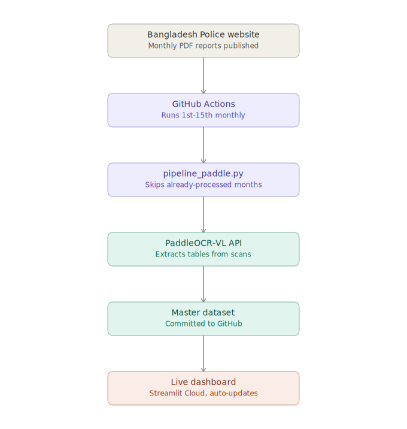

# Bangladesh Crime Data Automation and Analysis

An automated pipeline that scrapes crime statistics published by the
[Bangladesh Police](https://www.police.gov.bd/), extracts the tables from
scanned monthly reports, and consolidates everything into clean CSVs for
analysis.

**Live dashboard:** [bangladesh-crime-data-automation-and-analysis-bvphgl452h7man7k.streamlit.app](https://bangladesh-crime-data-automation-and-analysis-bvphgl452h7man7k.streamlit.app)

<p align="center">
  
</p>

## 📊 Data source

The Bangladesh Police publishes crime statistics broken down by unit
(metropolitan police, ranges, etc.) and crime type:

- **2010-2019**: available as real HTML tables (`crime_statistic/year/{year}`)
- **2019-present**: published monthly as scanned PDF reports (no text layer),
  listed on paginated announcement pages

## ⚙️ How it works

1. **`scrape_listing.py`** walks the paginated announcement listing and
   collects one record per monthly PDF report (title, month, year, download
   URL).
2. **`scrape_year_table.py`** pulls the older (2010-2019) annual tables
   directly from HTML — no OCR needed. 2010-2018 of this output has since
   been merged into `bd_crime_monthly_master_paddle.csv` as annual-only rows
   (`is_annual_total=True`, no monthly breakdown); 2019 is deliberately
   excluded from the merge since the master already has full monthly 2019
   data from the PDF pipeline. The `"Barisal Range"` spelling used here is
   aliased to `"Barishal Range"` (the modern spelling) during the merge.
3. **`extract_pdf_table.py`** processes each scanned PDF page: extracts the
   embedded raster image, detects the table's grid lines with OpenCV, OCRs
   the page, and maps each recognized token to its (row, column) cell using
   the grid geometry. Cells the OCR can't confidently read are left blank and
   logged for manual review rather than guessed. The OCR backend is
   pluggable:
   - `vision` (default): macOS's Vision framework, via the compiled
     `ocr.swift` helper — more accurate than Tesseract on this scan quality,
     tested empirically.
   - `paddleocr`: [PaddleOCR](https://github.com/PaddlePaddle/PaddleOCR), a
     cross-platform alternative (useful off macOS, or to compare accuracy
     against Vision). Install with
     `pip3 install -r scraper/requirements-paddleocr.txt`, then pass
     `--engine paddleocr` to `pipeline.py`, or `engine="paddleocr"` to
     `extract_pdf()`/`extract_page()` directly.
4. **`pipeline.py`** ties it together end-to-end: downloads and caches PDFs,
   runs extraction, writes one CSV per month, and concatenates everything
   into a master table.
5. **`pipeline_paddle.py`** builds a separate PaddleOCR-based master dataset
   (`data/bd_crime_monthly_master_paddle.csv`, kept apart from the Vision
   dataset for comparison). By default it uses the hosted
   [PaddleOCR-VL](https://paddleocr.ai/) API (`paddleocr_vl_api.py`): one
   job submission processes a whole PDF server-side and returns each page
   already parsed into markdown (tables as HTML), so known unit-name rows
   are matched directly out of each page's parsed table rather than going
   through `extract_pdf_table.py`'s OpenCV grid detection. This needs the
   `PADDLEOCR_API_TOKEN` environment variable set to an AI Studio access
   token. Pass `--engine local` instead to use the paddleocr Python library
   locally, per page (the original approach, via `extract_pdf_table.py`).

   This API path initially left some cells blank (a systematic gap where the
   "Railway Range" row was dropped on ~40% of pages, plus one isolated
   stray blank), all since resolved - see `data/blanks_review_paddle.csv`
   for the audit trail. The current `bd_crime_monthly_master_paddle.csv` has
   zero blank cells across all 1,728 rows.

   `run_api()` is incremental: any PDF whose filename already appears in
   the master's `source_pdf` column is skipped (no download, no API call),
   so re-running it only processes genuinely new months.

## 🤖 Automation

`.github/workflows/monthly_update.yml` runs `pipeline_paddle.py` on a
schedule (a few times during the 1st-15th of each month, since the police
site publishes on no fixed day within that window) and commits any new
rows back to `main`. Requires a `PADDLEOCR_API_TOKEN` repository secret.
Since the pipeline is incremental, a run where nothing new has been
published yet does no OCR work. The Streamlit Cloud app auto-redeploys
whenever new data is pushed.

## 📈 Dashboard

**`app/app.py`** is a [Streamlit](https://streamlit.io/) dashboard for
exploring `bd_crime_monthly_master_paddle.csv` (which now spans 2010-present
- see below): national/unit trends over time, a crime-type breakdown, and a
dedicated recovery-cases view. Columns prefixed `r_` (`r_arms_act`,
`r_explosive_act`, `r_narcotics`, `r_smuggling`) are **recovery cases** —
arms, explosives, narcotics, or smuggled goods recovered by police — as
distinct from the filed criminal case counts in the other columns. National
totals are read directly from the dataset's own `Total` row (trustworthy
now that the dataset has zero blank cells), while per-unit rankings always
come from the individual unit rows.

The "Total Cases Over Time" chart has a Year/Month view toggle, defaulting
to Year. 2010-2018 only ever had a yearly total published (no monthly
breakdown exists for those years), so switching to Month view drops them
from the chart with an explanatory note, rather than showing gaps. The
sidebar also has a Months filter alongside Year range and Units.

The **Crime Map** plots cases geographically using `bd_gis/` (see that
folder's own README for how the boundaries were built): the 8 Ranges as
shaded polygons (real district-dissolved boundaries) and the 8 Metropolitan
Police units as size/color-scaled markers at their headquarters (no public
source ships thana-level boundary polygons for Metro units, so those are
points, not polygons). `ATU` and `Railway Range` have no geographic
boundary at all and are excluded from the map, with a caption noting so.

Live at [bangladesh-crime-data-automation-and-analysis-bvphgl452h7man7k.streamlit.app](https://bangladesh-crime-data-automation-and-analysis-bvphgl452h7man7k.streamlit.app),
or run it locally:

```bash
pip3 install -r app/requirements.txt
streamlit run app/app.py
```

## 🗂️ Repository layout

**`data/bd_crime_monthly_master_paddle.csv` is the final dataset** for this
project — it's what the dashboard reads and what the monthly automation
updates. It covers 2010-present and has zero blank cells, since the
PaddleOCR-VL API produces meaningfully more accurate OCR results than the
Vision/local-PaddleOCR pipeline (see the accuracy comparison above).
`bd_crime_monthly_master.csv` (Vision-based) is kept only as a reference for
that comparison, not used by the dashboard or automation.

```
.github/
  workflows/monthly_update.yml  # scheduled CI job that keeps the final dataset current (see Automation)

docs/
  pipeline-diagram.svg    # architecture diagram used in this README

scraper/
  scrape_listing.py       # discovers monthly PDF report URLs
  scrape_year_table.py    # scrapes 2010-2019 annual HTML tables
  extract_pdf_table.py    # OCR + table extraction from scanned PDFs (Vision or local PaddleOCR)
  paddleocr_vl_api.py     # client for the hosted PaddleOCR-VL API
  pipeline.py             # Vision / local-PaddleOCR pipeline orchestration
  pipeline_paddle.py      # PaddleOCR-VL API pipeline orchestration - builds the final dataset
  ocr.swift / build.sh    # macOS Vision-based OCR helper (compile with build.sh)
  bin/ocr                 # compiled OCR binary
  requirements.txt        # scraper/pipeline dependencies
  requirements-paddleocr.txt  # optional deps for the local paddleocr engine

app/
  app.py                  # Streamlit dashboard - reads bd_crime_monthly_master_paddle.csv
  requirements.txt        # dashboard dependencies

data/
  pdfs/                                # cached source PDF downloads
  monthly_csv/                         # per-month CSVs, Vision/local pipeline (reference only)
  monthly_csv_paddle/                  # per-month CSVs, PaddleOCR-VL pipeline
  annual_2010_2019/                    # per-year CSVs (2010-2019), scraped from HTML
  bd_crime_annual_2010_2019.csv        # consolidated annual table (2010-2019, HTML source)
  bd_crime_monthly_master.csv          # Vision-based master (2019-present) - reference only
  bd_crime_monthly_master_paddle.csv   # final master dataset (2010-present)
  blanks_review.csv                    # Vision pipeline's unread cells, for manual review
  blanks_review_paddle.csv             # PaddleOCR-VL pipeline's unread cells, for manual review
```

## 🛠️ Setup

```bash
pip3 install -r scraper/requirements.txt
./scraper/build.sh                 # compile the Vision OCR helper (macOS only)
```

## ▶️ Usage

```bash
python3 scraper/pipeline_paddle.py                 # builds the final dataset via the hosted PaddleOCR-VL API (default)
python3 scraper/pipeline_paddle.py --engine local   # uses the paddleocr Python library locally instead
```

This downloads any new monthly PDFs, extracts their tables, and refreshes
`data/bd_crime_monthly_master_paddle.csv` and `data/blanks_review_paddle.csv`
— incrementally, so re-running only processes genuinely new months (see
Automation above). Requires the `PADDLEOCR_API_TOKEN` environment variable
set to an AI Studio access token.

The Vision-based pipeline is kept only as a reference for the accuracy
comparison documented above, and can still be run directly:

```bash
python3 scraper/pipeline.py                    # OCRs scanned pages with Vision (default)
python3 scraper/pipeline.py --engine paddleocr  # OCRs scanned pages with the local paddleocr library instead
```

This refreshes `data/bd_crime_monthly_master.csv` and `data/blanks_review.csv`.
